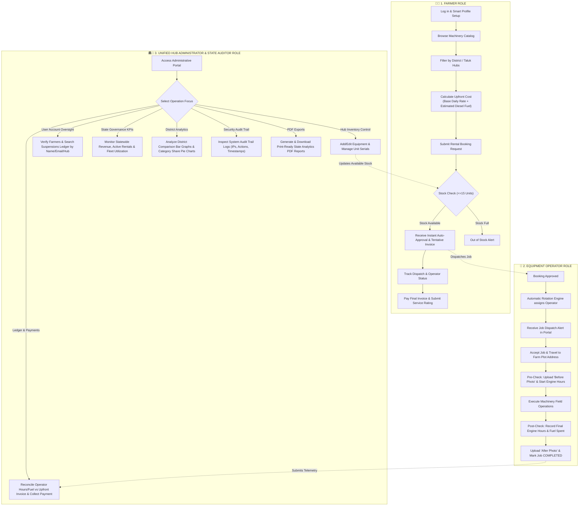

# 🌾 AgriRentGov - Unified System Architecture & Master Project Prompt


---

## 📊 1. Unified 3-Role Operational Flowchart Diagram

In this updated architecture, the **Cooperative Hub Manager** and **State Government Auditor** roles are merged into a single **Hub Administrator & State Auditor** role, streamlining hub operations and state-wide audit governance under one administrative interface.



---

## 📜 2. Master System Prompt for the Entire Project

Below is the complete, production-ready system specification prompt to generate or document the entire **AgriRentGov** platform with the joined **Hub Administrator & State Auditor** role.

```markdown
### 🎯 SYSTEM SPECIFICATION PROMPT: AgriRentGov Platform

#### 📌 Project Title
**AgriRentGov: Smart Agriculture Equipment Leasing, Dispatch & State Audit System**

#### 🌐 Project Context & Objectives
Build a full-stack, enterprise-grade agricultural machinery rental and management platform tailored for state cooperative hubs (specifically for Tamil Nadu districts like Coimbatore, Salem, Thanjavur, Madurai, Chennai, etc.). The system enables farmers to rent heavy agricultural equipment (Mahindra Tractors, Combine Harvesters, Rotavators, Seeders, Power Tillers) with upfront cost transparency, automatic operator rotation dispatch, field telemetry hour logging, hub ledger reconciliation, and state government audit oversight.

---

### 👥 1. Unified 3-Role Access Control Model

1. **Farmer Role (`Farmer`):**
   - **Profile:** Smart profile auto-populating Farmer ID, Mobile Number, District, Taluk, and Farm Address.
   - **Catalog:** Interactive machinery search filtered by District and Taluk hubs.
   - **Calculator:** Upfront cost calculator combining base rental rates and estimated diesel fuel consumption.
   - **Booking:** Instant booking submission triggering auto-stock verification (limit: 15 units per equipment type per hub).
   - **Tracking & Feedback:** Real-time job status tracking, final balance payment, star ratings, and review submission.

2. **Equipment Operator Role (`Equipment Operator` / `Operator`):**
   - **Job Dispatch:** Receives auto-routed job dispatches based on proximity (Taluk/District) and round-robin rotation.
   - **Pre-Check:** Uploads "Before Operation" machine condition photo and logs engine starting hours.
   - **Field Operation:** Executes field work while recording runtime metrics.
   - **Post-Check:** Uploads "After Operation" photo, logs ending engine hours, and records actual diesel spent (in Liters).
   - **Telemetry Push:** Submits completed job data to trigger automated invoice reconciliation.

3. **Unified Hub Administrator & State Auditor Role (`Hub Administrator & State Auditor`):**
   - **Fleet & Unit Management:** Add/edit equipment fleet rates and assign serialized unit numbers.
   - **Ledger Reconciliation:** Reconcile tentative invoices with operator-logged engine hours/fuel usage and process payments (Cash/UPI/Bank Transfer).
   - **User Oversight & Suspensions Ledger:** Verify farmer registrations and search/filter suspended accounts by name, email, role, or hub.
   - **Statewide Governance KPIs:** Monitor total platform revenue, active rentals count, fleet utilization percentage, and active cooperative hubs.
   - **District Analytics:** Visual comparison bar charts across districts and category revenue share pie charts.
   - **Immutable Audit Trail:** View security audit logs capturing user actions, IP addresses, parameter changes, and timestamps.
   - **PDF Reports Generator:** Export downloadable, print-ready state government audit PDF summaries.

---

### 🛠️ 2. System Architecture & Tech Stack

- **Frontend UI:** React 18, Vite, Lucide React Icons, Recharts for visualization, Vanilla CSS Tokens (dark theme aesthetic, glassmorphism, responsive CSS variables).
- **Backend API:** Node.js, Express.js REST API with JWT Auth middleware (`/api/auth`, `/api/equipment`, `/api/rentals`, `/api/jobs`, `/api/coop`, `/api/admin`, `/api/stats`).
- **Database:** MongoDB Atlas (Mongoose ODM) with fallback local JSON database handler (`db.js`).
- **PDF Engine:** Automated browser/PDF report generator for government state audit summaries.

---

### ⚙️ 3. Core Algorithms & Logic Engines

1. **Upfront Invoice Calculator Engine:**
   $$\text{Upfront Total} = (\text{Daily Rate} \times \text{Duration Days}) + (\text{Estimated Diesel Liters/Day} \times \text{Fuel Price} \times \text{Duration Days})$$

2. **Automatic Operator Rotation Engine (`rotationService.js`):**
   - Filters eligible operators by requested Taluk/District.
   - Excludes operators with overlapping active jobs during requested date window $[T_{\text{start}}, T_{\text{end}}]$.
   - Applies persistent round-robin index pointer to guarantee fair dispatch distribution among operators.

3. **Fleet Stock Validation Engine:**
   - Validates that total booked units do not exceed total hub capacity ($\le 15$ serialized units per equipment type).
   - Automatically sets booking status to `Approved` when stock is valid and issues a tentative upfront invoice.

4. **Engine Meter & Ledger Reconciliation Engine:**
   $$\text{Final Cost} = (\text{Actual Engine Hours} \times \text{Hourly Rate}) + (\text{Actual Fuel Liters} \times \text{Fuel Price})$$
   $$\text{Reconciled Balance} = \text{Final Cost} - \text{Upfront Amount Paid}$$

5. **Immutable Audit Logger Engine:**
   - Records every login, equipment addition, rate modification, status transition, and payment event with User ID, Role, IP Address, Action, and Timestamp.

---

### 📊 4. Database Schema Structure (`db.js`)

- **Users Collection:** `_id`, `name`, `email`, `mobile`, `role`, `district`, `taluk`, `cooperativeHub`, `isVerified`, `isSuspended`.
- **Equipment Collection:** `_id`, `name`, `category`, `district`, `taluk`, `cooperativeHub`, `rentPerDay`, `rentPerHour`, `estimatedFuelPerDay`, `totalUnits`, `units` (Array of serial strings).
- **Bookings Collection:** `_id`, `farmerId`, `equipmentId`, `unitId`, `status` (`Tentative` | `Approved` | `Active` | `Completed` | `Cancelled`), `startDate`, `durationDays`, `upfrontAmount`, `finalAmount`, `paymentStatus`.
- **Jobs Collection:** `_id`, `bookingId`, `operatorId`, `equipmentId`, `status` (`ASSIGNED` | `PRECHECK` | `IN_PROGRESS` | `COMPLETED`), `startEngineHours`, `endEngineHours`, `actualFuelUsed`, `beforeImageUrl`, `afterImageUrl`, `scheduledDate`.
- **Audit Logs Collection:** `_id`, `userId`, `role`, `action`, `details`, `ipAddress`, `timestamp`.
```
